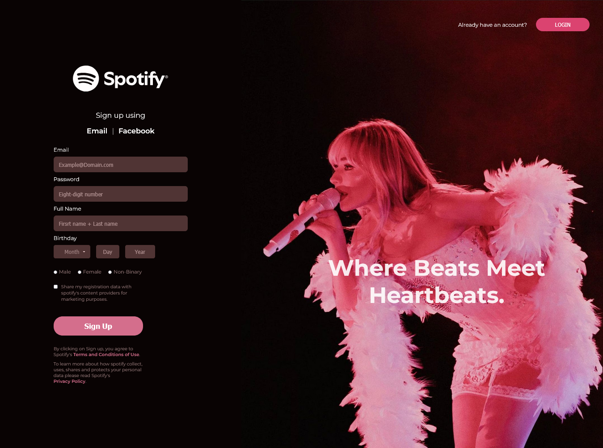

<h1 align="center">🎧 Spotify Signup Page</h1>

<p align="center">
  A clean and responsive replica of Spotify's signup page built using HTML and CSS.
</p>

<p align="center">
  <a href="https://github.com/zibaakord/spotify-signup-page"></a>
  <a href="#"></a>
</p>

---

## 📄 About

This project is a pixel-perfect clone of the **Spotify Signup Page**, designed to practice and showcase responsive layout techniques using **HTML5** and **CSS3**. It replicates the structure, form elements, and branding styles of the original page while maintaining clean and semantic code.

---

## 🛠️ Built With

| Technology     | Purpose                |
|----------------|------------------------|
| `HTML5`        | Page structure         |
| `CSS3`         | Styling and layout     |

---

## 📷 Preview



> If the image does not appear, make sure `screenshot.png` is placed in the project root or update the path accordingly.

---

## 🚀 Getting Started

To run this project locally:

```bash
git clone https://github.com/zibaakord/spotify-signup-page.git
cd spotify-signup-page
open index.html